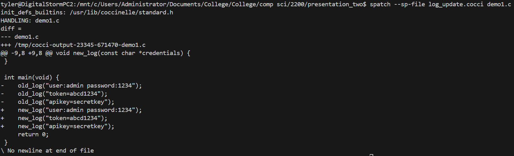
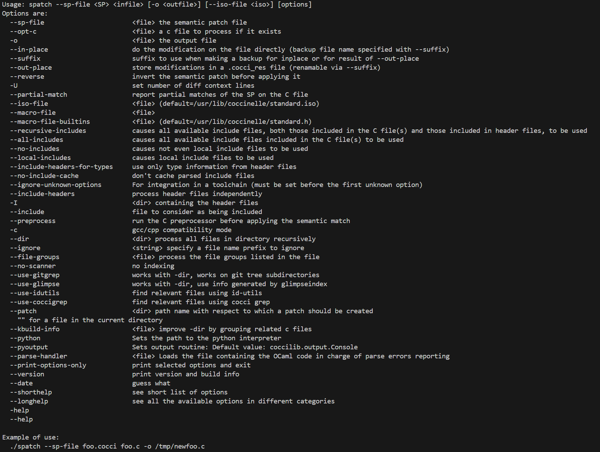

# CYB2200 Coccinelle Presentation

**By Joe, Chris, and Tyler**

## Overview
This project is a short introduction to **Coccinelle**, a tool used for matching and transforming patterns in **C code**. For this presentation, we are focusing on a very small and simple use case so the basic idea is easier to understand.

This does **not** represent the full set of features or real-world use cases of Coccinelle. Instead, this is a short explanation and demonstration of how Coccinelle can use **pattern matching** to find and update repeated forms in C source files.

## What Coccinelle Does
Coccinelle is a tool for working with code (C/C++ examples for this class) using rules written in **SmPL** (Semantic Patch Language). These rules can be used to:

- find repeated code patterns
- check for specific code forms
- automatically transform matching code

In basic terms, Coccinelle acts like a smart search-and-rewrite tool.

## Installation
A simple way to install Coccinelle on Ubuntu, WSL or MAC OS is:

```bash
LINUX
sudo apt update
sudo apt install coccinelle (version 1.1.1)
spatch --version

MAC (Homebrew Method Verified)
brew install coccinelle (version 1.3.1)
brew info coccinelle
```

The first demonstration is using ```demo1.c``` and ```log_update.cocci```. This will show how easy it is to update something like an API call when needs change. First, run the following command ```$ spatch --sp-file log_update1.cocci demo1.c```. ```spatch``` ensures that we are using coccinelle ```--sp-file``` use the semantic patch rules in the file ```log_update1.cocci``` and ```demo1.c``` is your target file. Run this and you should get an output that looks like this. 



This is nice because it verifies the file to be operated on, and shows a diff of what changes are to occur. Notice that this is done without compilation and only looking at the form of the code itself.

## Make The Changes
Now if we want to set these changes we have 2 general options the first is to create a new file using the command ```$ spatch --sp-file log_update.cocci demo1.c -o demo1_updated.c```. This will create a new file under the name demo1_updated.c.

    Note: Writing a new file may take some time to finish

If we want overwrite this file we will use the command ```$ spatch --sp-file log_update.cocci --in-place demo1.c```


## List Of Commands
